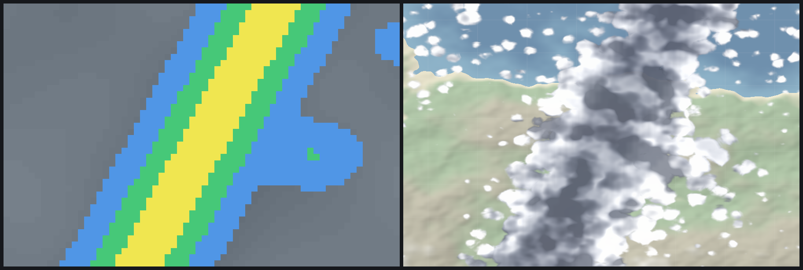
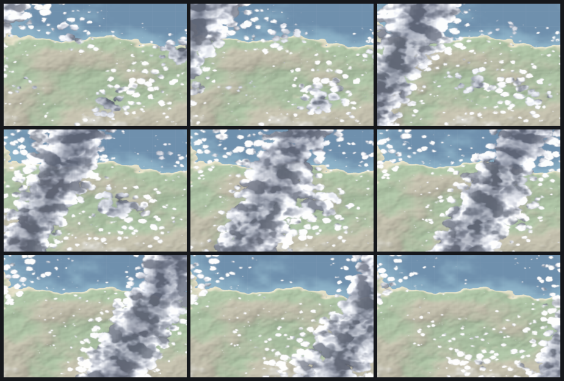

# turbomap-clouds

Procedural GPU cloud overlay for **precipitation** and **cloud-coverage**
radar data, for the turbomap wgpu engine (Android / desktop).

Instead of painting the blocky, pixelated radar raster directly onto the
map, this layer feeds that same data into a fragment shader that grows
soft, billowy, volumetric-looking clouds on top of it — **darker cloud =
heavier rain** — and crossfades between radar timesteps so a time slider
can scrub smoothly **forward and backward**.

Raw blocky radar (left) vs. the procedural cloud render of the same
timestep — bright fair-weather cumulus, with the heavy-rain band rendered
as a dark stormy mass:



The storm system sweeping across the map as the time slider advances:



Run the demo (writes `before_after.png`, `contact_sheet.png`,
`frame_###.png`, and a forward+backward `scrub.gif`):

```sh
cargo run --release -p turbomap-clouds --example render_clouds /tmp/turbo-clouds
# fast single-frame iteration:
CLOUDS_QUICK=1 cargo run --release -p turbomap-clouds --example render_clouds
```

The demo renders headless through the golden harness's software adapter
(Lavapipe), so it produces deterministic screenshots with no window, no
network, and no real GPU.

## How it looks 3D without raymarching

It's a flat 2D field, shaded to fake volume — cheap enough for a mobile
GPU in a single fragment pass (no compute, no 3D textures):

1. **De-block the radar.** Smoothstep-bilinear upsampling turns the coarse
   grid into a smooth coverage/precip field (`sample_radar`).
2. **Grow cloud detail.** Domain-warped fractal noise (`fbm4(p + warp)`)
   blended with inverted-Worley "cauliflower" lumps gives billowy shape;
   coverage thresholds it so puffs have real gaps, not a flat overcast
   sheet; a high-frequency Worley layer erodes wispy edges. This is the
   Horizon Zero Dawn / "Nubis" density recipe collapsed to a flat field.
3. **Fake the lighting.** A normal is finite-differenced from a cheap
   height proxy, lit by a fixed sun with a short march-toward-the-sun
   self-shadow (Beer falloff), ambient occlusion in the valleys, and a
   silver-lining rim. Sunlit tops go bright, undersides go dark.
4. **Colour by rain.** Precipitation drives the albedo from bright white
   cumulus → grey → charcoal storm, and pushes heavy rain optically
   opaque so it reads stormy rather than muddy.
5. **Animate.** Noise drifts with a wind vector and "boils" via an
   evolution offset in the domain warp; two radar frames crossfade
   (`blend`) while that procedural motion runs continuously, so scrubbing
   never pops between timesteps.

See `src/clouds.wgsl` for the full shader and the technique references.

## Data contract — same MET sources as the app

Each [`RadarFrame`](src/data.rs) is a small `width × height` grid; every
cell carries two channels in `0..=1`:

- `precip` — rain intensity → how *dark* the cloud paints.
- `coverage` — cloud-area fraction → *where* / how much cloud exists.

This is exactly the shape of the "blocky" rasters the app already pulls
from MET Norway (`api.met.no`, the same host as the existing
`locationforecast` weather feature):

- **Precipitation** — radar reflectivity
  (`api.met.no/weatherapi/radar/2.0`) or the gridded **nowcast** product.
- **Coverage** — `cloud_area_fraction` from the AROME grid /
  locationforecast.

The demo fills the grid with a [`SyntheticStorm`](src/data.rs) (a frontal
rain band with embedded convective cores) so it runs offline. A live
integration replaces only that step: fetch the radar/cloud tile for the
viewport, sample it per cell in Web-Mercator tile space, normalise to
`0..=1`, and `CloudScene::upload(...)` the frame. Everything downstream —
the GPU pipeline, the crossfade, the time slider — is source-agnostic.

## Wiring into the live map / Android

[`CloudScene`](src/lib.rs) is self-contained (its own fullscreen pass, no
depth, no MSAA) and composites with premultiplied alpha, so it drops onto
any wgpu target:

```rust
let scene = CloudScene::new(&device, surface_format, grid_w, grid_h);
scene.upload(&queue, 0, &frame_t0);   // current radar frame
scene.upload(&queue, 1, &frame_t1);   // next radar frame
// each rendered frame, over the live map (draw_basemap = false):
scene.render(&queue, &mut encoder, &view, &params, false);
```

- `params.blend` is the time slider's position between the two loaded
  frames; load the next pair as the user scrubs.
- `params.time` is a free-running clock for drift/boil.
- `draw_basemap = false` skips the demo's stylised land/sea backdrop and
  blends clouds straight over whatever the map already drew.

On Android this renders on the same wgpu surface turbomap already uses via
`turbomap-ffi`; the radar fetch lives on the Dart/host side and hands
frames across the FFI boundary, just like the existing tile sources.
